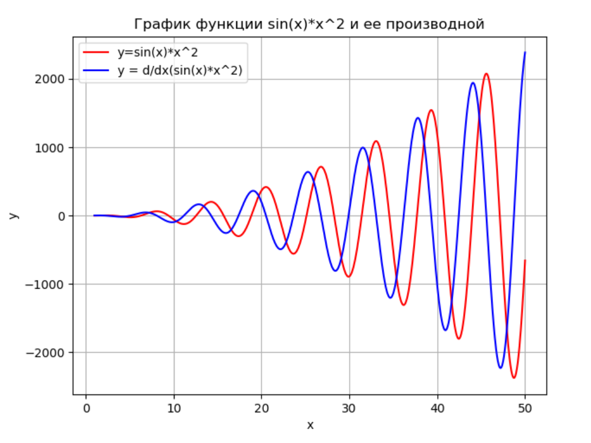

# Краткое руководство по языку Python

## Работа в консоли, выполнение скриптов.

Работа в интерактивном интерпритаторе выполняется так же, как и при обычном наборе скриптов. Пишите выражение, оно выполняется. Если не присваивать результат выражения переменной, то она выведется в консоль. Чтобы выйти из консольного режима, используйте команду `quit()` или сочетание клавиш `Ctrl+Z Enter`. Чтобы очистить вывод, используйте команду `clear()`. Для очистки переменной используется команда `del var_name`.
Для выполнения скрипта из консоли используйте команду `python script_name.py`. Если на вашем компьютере установлено две версии Python (2.x и 3.x), нужно указать нужную версию: `python3 script_name.py`. Для установки необходимых библиотек используйте команду `pip install lib_name`. Если вы хотите подключить свой скрипт `sctipt_name.py` к другому скрипту, если они лежат в одной папке, используйте команду `import scrtipt_name`. Если хотите создать подключаемую библиотеку, нужно в папке с этой библиотекой создать файл `__init__.py`. Тогда подключение скрипта с адресом `package/script.py` будет выглядеть так: `import package`.
Для разработки можно также воспользоваться PyCharm IDE, Visual Studio, Jupyter Notebook или Kaggle Notebook на kaggle.com (требуется регистрация).

Так же для работы над курсом нейронных сетей вам понадобятся библиотеки *numpy*, *scipy*, *matplotlib*, *pandas*, *sympy* и *sklearn* . Далее в тексте используются сокращения:

```python
import numpy as np #библиотека для математических вычислений и работы с массивами
import scipy as sp #библиотека для научных вычислений
import matplotlib.pyplot as plt #matlab-like библиотека для рисования графиков
import pandas as pd #библиотека для работы с данными
import sklearn as sk #библиотека для построения моделей
from mpl_toolkits import mplot3d #библиотека для трехмерной графики
```

## Наиболее часто использующиеся типы данных и создание переменных

* Логический тип *bool*

  * `True`

  * `False`

* Отстутствующее значение

  * `None`

* Число с плавающей точкой *float*

  * `x = 5.4`

* Целочисленный тип *int*

  * `x = 5`

* Строка *str*

  * `x = "string"`

  * `x = 'string'`

  * текст на нескольких строках

  ```python
  x = '''
      multi-
      line
      string
      '''
  ```

  ```python
  x = """
      multi-
      line
      string
      """
  ```

  * сырые строки

  ```python
  x = r"raw string"
  ```

  * форматированные строки

  ```python
  x = 5
  y = f'x = {x}' # 'x = 5'
  ```

  * можно комбинировать несколько различных видов кавычек

  ```python
  x = """level1 '''level2 " level3 'level4' level3" level2''' level1"""
  ```


* Кортеж *tuple*

  * `x = (1, 2)`

* Список *list*

  * `x = [ 0, 1, 2 ]` - массив 1х3

  * `x = [ [0, 1, 2], [3, 4, 5], [6, 7, 8] ]` - альтернатива двухмерному массиву 3x3

* массив *numpy.array*

  ```python
  >>> np.array([1, 2, 3.0])
  array([ 1.,  2.,  3.])
  ```

  ```python
  >>> np.array([[1, 2], [3, 4]])
  array([[1, 2],
        [3, 4]])
  ```

* Указатель на функцию *function*

  * более подробно рассмотрен в разделе "Создание и работа с функциями"

## Операции над переменными

Python поддерживает следующие операции:

1. Арифметические операции

  * `a + b` - сложение

  * `a - b` - вычитание

  * `a * b` - умножение

  * `a / b` - деление

  * `a // b` - деление нацело

  * `a ** b` - возведение в степень

  * `a % b` - остаток от деления

  * операции с присвоением: `+=`, `-=`, `*=`, `\=`

2. Операции отношения

  * равно: `==`

  * не равно: `!=`

  * меньше: `<`

  * больше: `>`

  * меньше или равно: `<=`

  * больше или равно: `>=`

3. Логические операции

  * И: `and`

  * ИЛИ: `or`

  * НЕ: `not`

4. Тригонометрические функции

  * обычные: `np.sin(x), np.cos(x), np.tan(x)`

  * обратные: `np.arcsin(x), np.arccos(x), np.arctan(x)`

  * гиперболические: `np.sinh(x), np.cosh(x), np.tanh(x)`

  * обратные гиперболические: `np.arcsinh(x), np.arccosh(x), np.arctanh(x)`

5. Экспоненциальные и логарифмические функции

  * по основанию e: `np.exp(x), np.log(x)`

  * по основанию 10: `log10(x)`

  * по основанию 2: `log2(x), exp2(x)`

6. Округление и остаток от деления

  * `np.floor(x)` Округление до ближайшего целого в сторону отрицательной бесконечности

  * `np.ceil(x)` Округление до ближайшего целого в сторону положительной бесконечности

  * `np.round(x)` Округление до ближайшего целого

  * `np.abs(x)` Модуль числа

7. Операции с массивами/матрицами - нумерация начинается с 0

  * обычные арифметические операции

  * `list[i]` - вернет i-й элемент списка

  * `array[i, j]` - вернет элемент (i,j) массива array

  * `array[:, j]` - вернет столбец j массива array

  * `len(array)` - длина массива

  * `array.shape` - вернет кортеж с размерностями матрицы

  * `np.dot(A, B)` - произведение матриц

  * `A @ B` - произведение матриц

  * `np.det(M)` - определитель матрицы

  * `np.linalg.inv(M)` - обратная матрица

  * `np.transpose(M)` - транспонирование матрицы

  * `M.T` - транспонирование матрицы

  * `np.concatenate((a, b, ...))` - конкатенация массивов

  * `M.reshape(new_x, new_y)` - изменить форму массива

  * `M.view()` - создает представление для массива

  * `M.copy()` - создает глубокую копию массива

  * `np.linalg.norm(M)` - норма Фробениуса

  * `np.linalg.norm(M, 1)` - норма L1 (максимум суммы по столбцам)

  * `np.linalg.norm(M, np.inf)` - норма L inf (максимум суммы по строкам)

  * `np.trace(M)` - след матрицы

  * `np.linalg.matrix_rank(M)` - ранг матрицы

  * `la, v = np.linalg.eig(M)` - собственные значения и собственные вектора матрицы

  * выполнить действие над элементами итерируемого объекта:

  ```python
  list(map(lambda x: statement), iterable)
  ```

  * отфильтровать элементы итерируемого объекта:

  ```python
  list(filter(lambda x: statement), iterable)
  ```

8. Работа со специальными значениями

  * `np.nan` - не число

  * `np.inf` - бесконечность

  * `np.isnan(x)` - проверка на NaN

  * `np.isinf(x)` - проверка на Inf

  * `np.pi` - число Пи

9. Работа с комплексными числами

  * `0.0 + 1.0j` - комплексное число с использованием литерала

  * `np.complex(0.0, 1.0)` - комплексное число

  * `np.complex(A, B)` - комплексная матрица A + Bj

  * `np.real(a)` - действительная часть

  * `np.imag(a)` - мнимая часть

  * `np.angle(a, deg=True)` - угол комплексного числа на плоскости

  * `np.fft.fft(a)` - быстрое преобразование Фурье

  * `np.fft.ifft(a)` - обратное быстрое преобразование Фурье

  * `np.conj(M)` - эрмитово сопряжение матрицы

  * `M.H` - эрмитово сопряжение матрицы


## Операции вывода на экран

|Функция | Параметры | Описание|
|--- | --- | ---|
|`print(x)` | Переменная | Вывод х на экран|
|`formatSpec.format(A1,...,An)` | A1,...,An - переменные, formatSpec - формат вывода | Форматированный вывод переменных A1,..., An|
|`f"text{A1}...text{An}"` | A1,...,An - переменные | Форматированный вывод переменных A1,...,An|


Символы форматирования, которые могут использоваться в formatSpec:

|Символ|Описание|
|---|---|
|%d|Десятичное число|
|%e, %f, %g|Число с плавающей точкой|
|%i|Целое число со знаком|
|%o|Восьмеричное число со знаком|
|%u|Десятичное целое число со знаком|
|%x|Шестнадцатеричное целое число со знаком|

## Циклы и условные переходы

* Условие:

```python
if expression:
    statements
elif expression:
    statements
...
else:
    statements
```

Поддерживаются также двойные условия:
```python
if a < b < c:
    statements
```

* Цикл for:

```python
for i in valuesrange:
   statements
```

  для создания диапазона значений используются функции:

  * создает диапазон `[start, stop)` c целочисленным шагом `step`

  ```python
  range(start, stop, step)
  ```

  * создает диапазон `[start, stop)` c шагом `step`

  ```python
  np.arange(start, stop, step)
  ```

  * создает диапазон `[start, stop)` c шагом `(stop-start)/num`

  ```python
  np.linspace(start, stop, num)
  ```

* Цикл While:

```python
while condition:
   statements
```

## Создание функций

Функции можно создавать в любом месте.

* обычные функции

```python
def function(in1,in2,in3, ..., inN):
    statements
    return out
```

* лямбда-выражения

```python
lambda in1,in2,in3, ..., inN: statement
```

## Функции для работы с файлами

`f = open(file_name, mode)` - открытие файла (по умолчанию файл открывается в текстовом режиме)
`f.close()` - закрытие файла после работы с ним
При работе с конструкцией `with` ресурсы будут автоматически освобождены
```python
with open(file_name, mode) as file:
    statements
```
`mode` может принимать комбинацию следующих значений:

| Режим | Обозначение |
| --- | --- |
|'r'|открытие на чтение (является значением по умолчанию)|
|'w'|открытие на запись, содержимое файла удаляется, если файла не существует, создается новый |
|'x'|открытие на запись, если файла не существует, иначе исключение |
|'a'|открытие на дозапись, информация добавляется в конец файла|
|'b'|открытие в двоичном режиме (является значением по умолчанию)|
|'t'|открытие в текстовом режиме|
|'+'|открытие на чтение и запись|

`f.read()` - чтение файла целиком
`f.read(n)` - прочитать `n` байт/символов из файла
Построчное чтение:

```python
for line in f:
    statements
```

`f.write(data)` - записать data в файл

Сохранить массив в файл:

```python
np.savetxt("myarray.csv", arr, delimeter=',')
```

Загрузить из файла:

```python
np.genfromtxt("myarray.csv", delimeter=',')
```

## Функции построения графиков

Функции для построения графиков:

### Двухмерная графика

|Функция | Параметры | Описание |
|--- | --- | ---|
|`plt.figure(number)` | Номер окна для графика | Создать окно для фигуры №number. Не обязательная команда, если используется только одно окно для графика|
|`plt.grid()` | | Показать сетку на графике|
|`plt.axis([xmin, xmax,  ymin,  ymax])` | Масштабы по осям координаты | Выставить масштабы графика|
|`plt.title(title)` | Строка заголовка | Вывести заголовок графика|
|`plt.xlabel(x)` | Строка подписи | Вывести подпись к оси x|
|`plt.ylabel(y)` | Строка подписи | Вывести подпись к оси y|
|`plt.legend(legend1,...,legendN)` | Строки, описывающие график | Вывести легенду на график|
|`plt.plot(X1,Y1,LineSpec1,...,Xn,Yn,LineSpecN)` | Пары (X, Y) - массивы точек x и y соответственно, массивы должны быть одной размерности, LineSpec - спецификации графиков | Нарисовать график по точкам |
|`plt.loglog(x, y)` | Массивы переменных | Логарифмический масштаб|
|`plt.polar(phi,r)` | Массивы переменных | Полярные координаты|
|`plt.stairs(x,y)` | Массивы переменных | График в виде ступенчатой линии|
|`plt.hist(y, x)` | Массивы переменных | Гистограмма|
|`plt.bar(x, y)` | Массивы переменных | Столбчатая диаграмма|
|`plt.imshow(x)` | Массив переменных | Вывести массив как картинку|
|`plt.show()` | | Показать график|

### Трехмерная графика

|Функция | Параметры | Описание |
|--- | --- | ---|
|`ax = plt.axes(projection='3d')`||Трехмерное пространство|
|`ax.plot3D(x, y, z, linespec)`|x, y, z - массивы значений, должны быть одной размерности, linespec - спецификация графика|Нарисовать график в трехмерном пространстве|
|`ax.set_xlabel('x')`, `ax.set_ylabel('y')`, `ax.set_zlabel('z')`|Подписи к осям|Подписать оси x, y и z соответственно|
|`ax.set_title(title)`|Строка заголовка|Вывести заголовок графика|

### Спецификации линий

|Тип линии | Тип точки | Цвет|
|--- | --- | ---|
|Непрерывная 	- | Точка 	. | Желтый 	y|
|Штриховая 	-- | Плюс 	+ | Фиолетовый 	m|
|Двойной пунктир 	: | Звездочка 	* | Голубой 	c|
|Штрих-пунктирная 	-. | Кружок 	o | Красный 	r|
|| Крестик 	х | Зеленый 	g|
||| Синий 	b|
||| Белый 	w|
||| Черный 	k|

Пример построения графика:
```python
x = np.linspace(1, 50, 1000)
y1 = np.sin(x)*np.square(x)
y2 = x*(2*np.sin(x)+x*np.cos(x))
plt.grid() #отобразить сетку на графике
plt.plot(x,y1,'r') #нарисовать график функции y1 красным цветом
plt.plot(x, y2, 'b') #нарисовать график функции y2 синим цветом
plt.xlabel('x') #подписать ось абсцисс
plt.ylabel('y') #подписать ось ординат
plt.title('График функции sin(x)*x^2 и ее производной') #добавить заголовок графику
plt.legend(['y=sin(x)*x^2', 'y = d/dx(sin(x)*x^2)']) #указать на картинке подписи к графикам
plt.show() #отобразить графики
```



## Статистические функции.

* `np.random.randn(M,N)` - вернет матрицу MxN c нормально распределенными элементами с матожиданием 0 и дисперсией 1

* `np.random.normal(m, s, size = (M,N))` - вернет матрицу MxN c нормально распределенными элементами с матожиданием m и среднеквадратичным отклонением s

* `np.random.uniform(A,B, size = (M, N))` - вернет матрицу MxN c равномерно распределенными элементами на отрезке (A,B)

* `np.mean(X)` - матожидание матрицы X

* `np.var(X)` - дисперсия матрицы X

* `np.std(X)` - среднеквадратичное отклонение матрицы X

* `np.median(X)` - медиана матрицы X

* `np.correlate(a, b)` - найдет корреляцию между a и b

* `np.corrcoef(a, b=None)` - найдет коэффициент корреляции

## Функции для решения матричных уравнений.

```python
np.linalg.solve(a,b)
#решение уравнения aX = b
#a матрица MxL, b - матрица MxN
#возвращаемое значение X - матрица LxN
```

```python
np.zeros((M,N)) #генерирует нулевую матрицу MxN
```

```python
np.eye(N, M=None, k=0) # генерирует матрицу NxM, у которой на диагонали k стоят единицы
#(k>0 - верхние диагонали отностиельно центральной, k<0 - нижние), а на всех остальных местах нули
```

```python
np.ones((M, N)) #генерирует матрицу MxN из единиц
```

```python
np.square(m) # возвести элементы матрицы в квадрат
```

```python
np.sqrt(m) # взять квадратный корень от элементов
```

## Функции решения дифференциальных задач.

```python
integrate.odeint(f, Y0, t)
#решение уравнения Y' = f(y, Y', t)
#f - функция или лямбда-выражение, Y0 - набор начальных условий, t - вектор значений переменной
#возвращаемое значение - вектор Y'
```

Пример:

Решение системы ДУ первого порядка

```python
def f(y, t):
    alfa = 0.8; beta = 0.3; c = 0.5; d = 0.2
    return [((alfa - c*y[1])*y[0]), ((-beta + d*y[0])*y[1])]
t = np.linspace(0, 100, 10000)
Y = integrate.odeint(f, [1, 2], t)
```

## Измерение времени

```python
from time import time

stime = -time()
do_smth()
stime += time()
print(stime)
```

В Jupyter Notebook:

`%%time` в начале ячейки

## Символьные вычисления в Sympy

```python
from sympy import init_printing, symbols, diff
from sympy.abc import alpha, x
from sympy.plotting import plot3d
```

Для красивого вывода символьных выражений используется `init_printing()`. В консоли Python выражения будут выглядеть, как ascii-art, а, например, в Jupyter Notebook как полноценное символьное выражение.

Для создания символьной переменной можно воспользоваться либо функцией `symbols`:

```python
x, y = symbols('x y')
```

Либо готовыми переменными из `sympy.abc`:
```python
x, a = x, alpha
```

С помощью переменных можно создавать выражения:

```python
y = (1+exp(-a*x))**-1
```

Библиотека поддерживает большинство математических операций (действия с полиномами, разложения в ряд Тейлора, производные, интегралы, нахождение пределов, решение ДУ и СЛАУ, матричные вычисления, статистические функции, комбинаторика), например нахождение производной:

```python
dy = diff(y,x)
```

Можно также рисовать графики с символьными переменными с помощью `sympy.plotting`:
```python
plot3d(cos(x*3)*cos(y*5)-y, (x, -1, 1), (y, -1, 1))
#нарисует функцию cos(x*3)*cos(y*5)-y в области [-1; 1]x[-1; 1]
```


## Работа с данными в Pandas

file.csv:

|a|b|c|d|
|--- | --- | ---| ---|
|1|2|3|4|
|5|6|7|8|
|9|10|11|12|
|13|14|15|16|

Загрузить данные из CSV-файла. Есть также функции для загрузки файлов Excel, таблиц SQL. Будет возвращен класс `pandas.DataFrame`

```python
df = pd.read_csv('file.csv')
```

`df['b']` - вернет столбец 'b'

`df[['b', 'c']]` - вернет столбцы 'b' и 'c'

`df.b` - вернет столбец 'b'

`df[df['b'] > 6]` - вернет все строки, где в столбце 'b' значение больше 6

`df.drop('d', axis=1)` - вернет DataFrame без столбца 'd'

`df.plot.hist()` - построит гистограмму по каждому столбцу

`df.plot.scatter(x='a', y='b')` - построит пары точек на плоскости x, y

`df.corr()` - найдет корреляцию для текущего DataFrame

`df.corrwith(other_df)` - найдет корреляцию с другим DataFrame

У класса `pandas.DataFrame` есть методы `sum(), count(), median(), apply(function), min(), max(), mean(), var(), std()` которые применяются к каждому столбцу данных

## Построение моделей в Scikit-Learn

### Создание обучающих и тестовых выборок из данных

```python
X_train, X_test, y_train, y_test = sk.model_selection.train_test_split(
    X, #вектор входных значений
    y, #вектор результатов
    test_size=0.33 #размер тестовой выборки
    )
```

### Многослойный персептрон:

Значения параметра activation:

* `‘identity’`, f(x) = x

* `‘logistic’`, f(x) = 1 / (1 + exp(-x))

* `‘tanh’`, f(x) = tanh(x)

* `‘relu’`, f(x) = max(0, x)

Значения параметра solver:

* `‘lbfgs’` - квазиньютоновские методы

* `‘sgd’` - метод градиентного спуска

* `‘adam’` - метод Adam

```python
mlp = sk.neural_network.MLPClassifier(
                    hidden_layer_sizes=(20,20), #количество нейронов в скрытом слое
                    activation='logistic', #функция активации
                    solver='sgd',
                    max_iter=5000, #максимальное число итераций
                    tol=1e-2, #предел обучения
                    n_iter_no_change=500 #если за такое число итераций точность обучения не меняется, то обучение заканчивается
                    verbose = True #выводить прогресс обучения
                    )
mlp.fit(X_train, y_train) #обучение
y_pred = mlp.predict(X_test) #предсказание
```

### Линейная регрессия:

```python
lr = sk.linear_model.LinearRegression()
lr.fit(X_train, y_train)
y_pred = lr.predict(X_test)
```

### Метод опорных векторов

Значения параметра kernel:

* ‘linear’ - линейное ядро

* ‘poly’ - полиномиальное

* ‘rbf’ - радиальная базисная функция

* ‘sigmoid’ - сигмоида

```python
svc = sk.svm.SVC(
                kernel='linear', #линейное ядро
                C=1, #параметр регуляризации
                gamma=0 #коэффициент ядра для ‘rbf’, ‘poly’ и ‘sigmoid’
                )
svc.fit(X_train, y_train)
y_pred = svc.predict(X_test)
```

### k-ближайших соседей

```python
knn = sk.neighbors.KNeighborsRegressor(
            n_neighbors=5 #число соседей
            )
knn.fit(X_train, y_train)
y_pred = knn.predict(X_test)
```

### Наивный баейсовский классификатор

```python
gnb = sk.naive_bayes.GaussianNB()
gnb.fit(X_train, y_train)
y_pred = gnb.predict(X_test)

```

### Метрики

* Точность классификации `sk.metrics.accuracy_score(y_test, y_pred)`

* Матрица ошибок `sk.metrics.confusion_matrix(y_test, y_pred)`

* Средняя абсолютная ошибка `sk.metrics.mean_absolute_error(y_test, y_pred)`

* Средняя квадратичная ошибка `sk.metrics.mean_squared_error(y_test, y_pred)`

### Сохранение обученной модели

Сохранить модель:

```python
sk.externals.joblib.dump(
                      model, #обученная с помощью метода fit модель
                      filename #название файла
                      )
```

Загрузить модель:

```python
model = sk.externals.joblib.load(filename)
```

## Работа в Jupyter Notebook

### Горячие клавиши

* `Shift+Enter` — выполнение текущей ячейки и перевод фокуса на следующую

* `Ctrl+Enter` — выполнение текущей ячейки и сохранение фокуса на текущей ячейке

* `Alt+Enter` — выполнение текущей ячейки и перевод фокуса на новую ячейку созданную ниже

* `Shift+Tab` - вызов документации

* `Alt + LMB` - мультикурсор

* `Y` - ячейка с кодом

* `M` - ячейка с Markdown

* `R` - ячейка для обычного текста

* `X` - удалить ячейку

### Специальные символы и команды

* `function_name?` - вызов документации к функции function_name

* `!command` - запуск команды command в командной строке

* `%run script` - запуск внешнего скрипта c адресом script

* `%load script` - вставка кода из внешнего скрипта c адресом script

* `%%writefile file` - записывает содержимое ячейки в файл file

* `%pycat file` - выводит содержимое файла file в ячейку

* `function();` - запрещает вывод результата функции

### Markdown

Доступны все возможности обычного Markdown, также можно добавлять LaTeX, который должен быть помещен между `$`:
`$e^{i\pi} + 1 = 0$`

## Ссылки

* https://www.python.org/downloads/ - скачать Python 3.7

* https://docs.python.org/3/ - документация по Python 3

* https://pythonworld.ru/ - русскоязычная документация (устаревшая)

* https://docs.scipy.org/doc/ - документация по numpy и scipy

* https://matplotlib.org/ - документация по matplotlib

* https://pandas.pydata.org/ - документация по Pandas

* https://scikit-learn.org/ - документация по Scikit-Learn

* https://jupyter-notebook.readthedocs.io/ - документация по Jupyter Notebook

* https://www.sympy.org/en/index.html - документация по SymPy